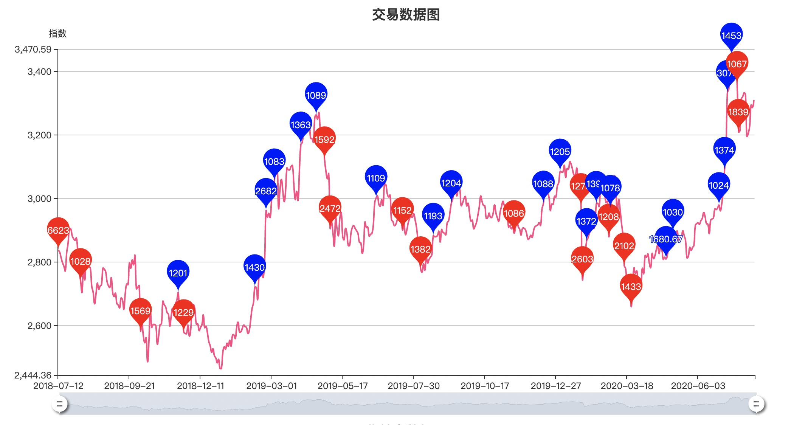
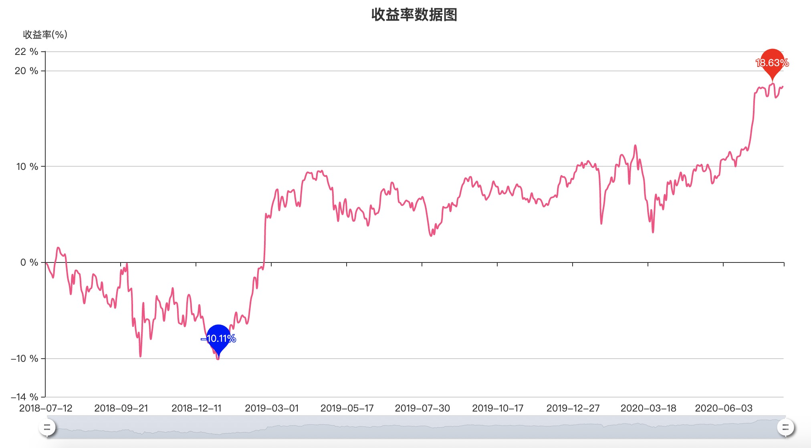

# 基金策略

## 运行环境

- python3 
    - requests包

## 使用方法

打开 **zhishu.py**  
编辑上面的参数列表

```python
# 基于指数估值和持仓曲线的投资策略
start_money = 10000  # 开始钱数
sale_hold_days = 60  # 持有多少个交易日可以卖出
buy_min_money = 1000  # 最小买入限制
sale_min_money = 1000  # 最小卖出限制
zhishu_low = 2500  # 指数低值, 低于低值将满仓
zhishu_high = 3500  # 指数高值，高于高值将空仓
buy_charge_percent = 0.001  # 买入手续费
sale_charge_percent = 0.005  # 卖出手续费
run_days = 500  # 回跑天数
today_value = None  # 当天指数
zhishu_code = "1.000001"  # 上证: 1.000001 成指: 0.399001 创业板: 0.399006
# 其他行业指数数据/code来源: http://quote.eastmoney.com/center/hsbk.html
```

运行
> python3 zhishu.py

运行一个http静态环境
> python3 -m http.server 80

网页访问
> http://localhost/zhishu.html

效果如下


